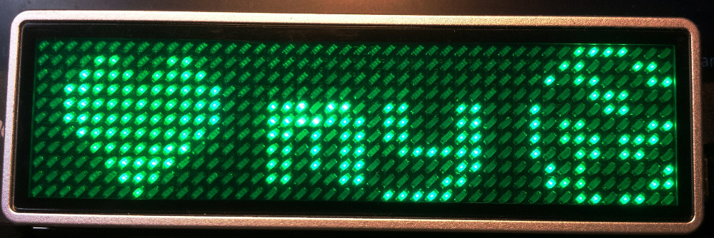

# Led-Badge-44x11
Upload tool for an led name tag with USB-HID interface

## Warning

There are many different versions of LED Badges on the market.
Some even look identical, but are not.
This one uses an USB-HID interface, while many others use USB-Serial.

The type supported by this project has an array of 44 x 11 LEDs and
identifies itself on the USB as

    idVendor=0416, idProduct=5020
    Mfr=1, Product=2, SerialNumber=0
    LSicroelectronics LS32 Custm HID

## Command Line Installation and Usage

Required dependencies on Debian/Ubuntu Systems:

    sudo apt install python3-usb

#### Examples:

    sudo python3 ./led-badge-11x44.py "Hello World!"

loads the text 'Hello World!' as the first message, and scrolls it from right to left (default scroll mode=0) and speed 4 (default). After an upload the device shows the first message once and returns to the charging screen if still connected to USB. Either pull the plug or press the small button next to the USB connector.

Sudo may or may not be needed, depending on your system.

    sudo python3 ./led-badge-11x44.py -m 6 -s 8 Hello World!

loads the text 'Hello' as message one and 'World!' as message two. Note the diffrence in quoting. Up to 8 messages can be uploaded. This example uses mode 6, which is dromps the words with a nice little animation vertically into the display area. Speed is set to maximum here, so that the animation is very smooth. Per default you will only see 'Hello'.
To see all messages, press the small button next to the USB connector multiple times, until you briefly see 'M1-8'. Now the display loops through all uploaded messages.

    sudo python3 ./led-badge-11x44.py -m 5 gfx/fablabnbg_logo_44x11.png

loads a fullscreen still image. (Or displays the pathname, if the image was not found. That is a hack. Sorry)

    sudo python3 ./led-badge-11x44.py -p gfx/heart.png -p gfx/fablab_logo_16x11.png  "I^Amy^Bfablab^B"

preloads two images, a heart and a crude fablab logo as images 1 and two. The images can then be embedded in a message by using control characters. To enter the ^A control character on the shell, press CTRL-V followed by CTRL-A.

    python3 ./led-badge-11x44.py --help

prints some condensed help:

<pre>
Usage: led-badge-11x44.py [-h] [-s SPEED] [-m MODE] [-p FILE]
                          MSG_OR_FILENAME [MSG_OR_FILENAME ...]

Upload messages or graphics to a 44x11 led badge via USB HID. Version 0.4 from
https://github.com/jnweiger/led-badge-44x11 -- see there for more examples and
for updates.

positional arguments:
  MSG_OR_FILENAME       Up to 8 message texts or image file names

optional arguments:
  -h, --help            show this help message and exit
  -s SPEED, --speed SPEED
                        Scroll speed. Up to 8 comma-seperated values (range
                        1..8)
  -m MODE, --mode MODE  Up to 8 mode values: Scroll-left(0) -right(1) -up(2)
                        -down(3); still-centered(4) -left(5); drop-down(6);
                        curtain(7); laser(8)
  -p FILE, --preload FILE
                        Load bitmap images. Use ^A, ^B, ^C, ... in text
                        messages to make them visible

Example combining image and text (enter the ^A character as CTRL-V CTRL-A):
sudo ./led-badge-11x44.py -p gfx/heart.png I^Ayou

</pre>

## References (all USB-Serial)
 * https://github.com/Caerbannog/led-mini-board
 * http://zunkworks.com/projects/programmablelednamebadges/
 * https://github.com/DirkReiners/LEDBadgeProgrammer
 * https://bitbucket.org/bartj/led/src
 * http://www.daveakerman.com/?p=1440
 * https://github.com/stoggi/ledbadge
